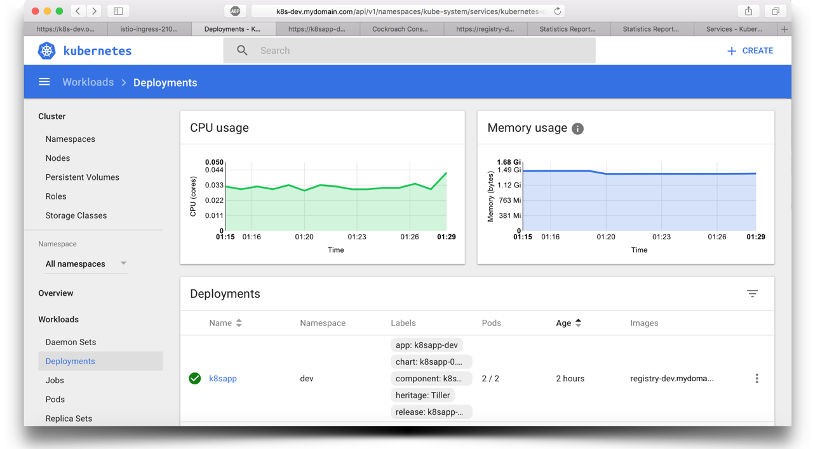
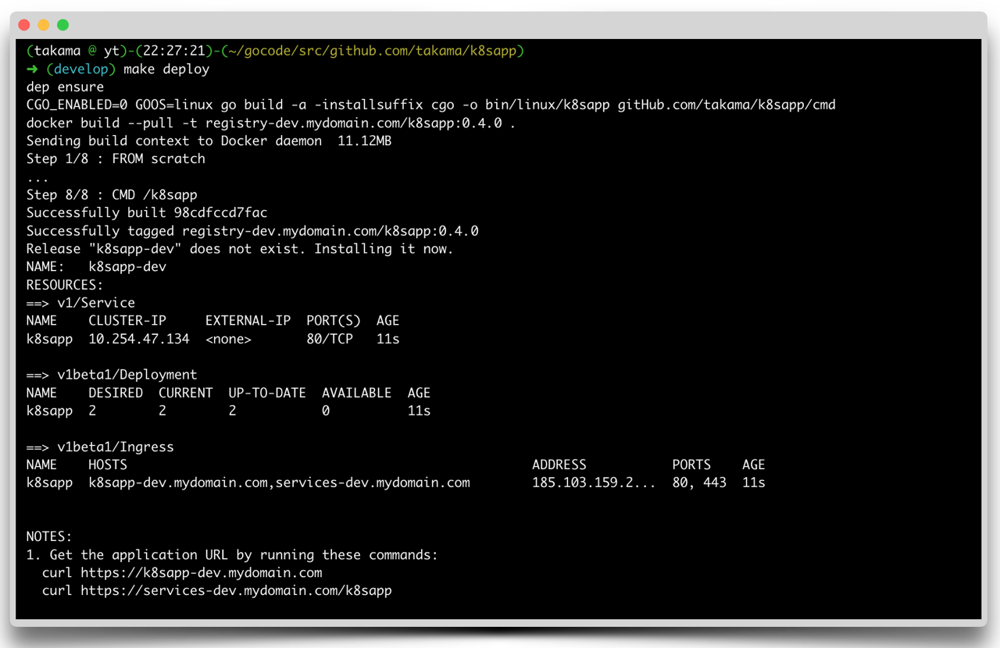

# Kubernetes application

[](https://travis-ci.org/takama/k8sapp)
[](https://github.com/takama/k8sapp/issues)
[](https://goreportcard.com/report/github.com/takama/k8sapp)
[](https://codecov.io/gh/takama/k8sapp)

A sample application that meets the requirements for successful execution in Kubernetes.



## Main application criteria

- Implementation of health checks
- Configuring the application through environment variables
- Standard logging Interface
- Processing of system interrupt signals and graceful shutdown
- Continuous build of the application and whole CI/CD process
- Helm charts for deploying an application in Kubernetes
- SSL support in a secure connection, certificate integration
- Integration of the official package manager `dep`
- Versioning automation

## Health checks

Kubernetes application must have [two health checks](https://kubernetes.io/docs/concepts/workloads/pods/pod-lifecycle/) for successful execution of the application. Integrated methods help correctly responding to Kubernetes queries.

## Configuring

The [twelve-factor](https://12factor.net/config) app stores config in environment variables. The application has a built-in library for automatic recognition and placement the environment variables in `struct` with different types.

## Logging

Provides a standard interface for a multi level logging. There is ability of choice of a logging library that supports a common interface.

```go
type Logger interface {
    Debug(v ...interface{})
    Debugf(format string, v ...interface{})
    Info(v ...interface{})
    Infof(format string, v ...interface{})
    Warn(v ...interface{})
    Warnf(format string, v ...interface{})
    Error(v ...interface{})
    Errorf(format string, v ...interface{})
    Fatal(v ...interface{})
    Fatalf(format string, v ...interface{})
}
```

Just make your choice

```go
func New(cfg *Config) Logger {
    // return newLogrus(cfg)
    // return newXLog(cfg)
    return newStdLog(cfg)
}
```

## HTTP Routers

Sometimes is difficult to decide which HTTP router we should use in our service. The interfaces help to adapt routers and switch it between each other without overhead.

__NOTE: this is optional, standard static router may conform better

### httprouter ([Julien Schmidt](https://github.com/julienschmidt/httprouter))

```go
type HTTPRouter interface {
    // Standard methods

    GET(path string, h httprouter.Handle)
    PUT(path string, h httprouter.Handle)
    POST(path string, h httprouter.Handle)
    DELETE(path string, h httprouter.Handle)
    HEAD(path string, h httprouter.Handle)
    OPTIONS(path string, h httprouter.Handle)
    PATCH(path string, h httprouter.Handle)

    // User defined options and handlers

    // If enabled, the router automatically replies to OPTIONS requests.
    UseOptionsReplies(bool)

    // SetupNotAllowedHandler is called when a request cannot be routed.
    SetupNotAllowedHandler(http.Handler)

    // SetupNotFoundHandler allows to define own handler for undefined URL path.
    SetupNotFoundHandler(http.Handler)

    // SetupRecoveryHandler is called when panic happen.
    SetupRecoveryHandler(func(http.ResponseWriter, *http.Request, interface{}))

    // Listen and serve on requested host and port e.g "0.0.0.0:8080"
    Listen(hostPort string) error
}
```

### Simple router implemented in this project and 100% tested

```go
type Router interface {
    // Standard methods

    GET(path string, f func(Control))
    PUT(path string, f func(Control))
    POST(path string, f func(Control))
    DELETE(path string, f func(Control))
    HEAD(path string, f func(Control))
    OPTIONS(path string, f func(Control))
    PATCH(path string, f func(Control))

    // The same options and handlers as in httprouter
 }
```

Used `Control` interface that simplify access to query parameters and simplify write data into HTTP output

```go
type Control interface {
    Request() *http.Request

    // Query gets URL/Post query parameters by key.
    Query(key string) string

    // Param sets URL/Post key/value query parameters.
    Param(key, value string)

    // Header represents http.ResponseWriter header.
    Header() http.Header

    // Code sets HTTP status code e.g. http.StatusOk
    Code(code int)

    // Write prepared header, status code and body data into http output.
    Write(data interface{})
}
```

## System signals

The application includes the ability to intercept system signals and transfer control to special methods for graceful shutdown.

```go
type Signals struct {
    shutdown    []os.Signal
    reload      []os.Signal
    maintenance []os.Signal
}
```

## Build automation

A series of commands for static cross-compilation of the application for any OS. Building the Docker image and loading it into the remote public/private repository. Optimal and compact `docker` image `FROM SCRATCH`

## Testing

The command `make test` is running set of checks and tests:

- run go tool fmt on package sources
- run go linter on package sources
- run go tool vet on packages
- run tests on package sources excluding vendor
- compile and check of Helm charts

## Helm charts and Continuous Delivery

Prepared set of basic templates for application deployment in Kubernetes. Only one command `make deploy` is loading the application into Kubernetes. Just wait for the successful result and the application is ready to go.



## SSL support

Generating certificates to create a secure SSL connection in the `Go` client. Attaching the certificate to the Docker image.

```Dockerfile
FROM scratch

ENV K8SAPP_LOCAL_HOST 0.0.0.0
ENV K8SAPP_LOCAL_PORT 3000
ENV K8SAPP_LOG_LEVEL 0

EXPOSE $K8SAPP_LOCAL_PORT

COPY certs /etc/ssl/
COPY bin/linux/k8sapp /

CMD ["/k8sapp"]
```

## Package manager

To work correctly with the dependencies we should choose the package manager. [dep](https://github.com/golang/dep) is a prototype dependency management tool for Go.

## Versioning automation

Using a special script to increase the release version

```sh
./bumper.sh
Current version 0.0.1.
Please enter bumped version [0.0.2]:
```

## Contributing to the project

See the [contribution guidelines](docs/CONTRIBUTING.md) for information on how to
participate in the Kubernetes application project by submitting pull requests or issues.

## License

[MIT Public License](https://github.com/takama/k8sapp/blob/master/LICENSE)
